# **Todo List Application - Angular** 📝

Welcome to my **Todo List Application** built using **Angular**! 🚀 This project allows users to easily manage their daily tasks by adding, deleting, and marking them as completed. The application stores data using **localStorage**, ensuring that your todos persist even after refreshing the page.

✨ **This is my first Angular project**, and I thoroughly enjoyed working with Angular. The framework offers a powerful set of tools, making development smooth and scalable for future projects. 

---

## **Features** 🌟

Here are some amazing features of the Todo List application:

1. **Add Todo** ➕  
   Add a new task to your todo list by entering a title and description. The app will immediately add the task to the list and save it to **localStorage**.

2. **Delete Todo** 🗑️  
   You can delete any task from the list. Upon deletion, the task is removed from the UI and from **localStorage**, ensuring it doesn't reappear after page reload.

3. **Toggle Todo Completion** ✅❌  
   Toggle the completion status of each task. Tasks marked as completed are visually highlighted. This status is saved in **localStorage**, so the completion status is remembered even after refreshing.

4. **Persistent Data** 🗃️  
   The app uses **localStorage** to persist your todos. This means your tasks will be available even after closing or refreshing the browser.

5. **Responsive Design** 📱💻  
   Thanks to **Bootstrap 5**, the app is fully responsive and looks great on mobile, tablet, and desktop devices. Your todo list will adapt to any screen size!

6. **About Page** ℹ️  
   An **About** page is included to give users some background on the app and explain its features.

---

## **Technologies Used** 🛠️

- **Angular 15** 🔥
- **Bootstrap 5** 📦
- **TypeScript** 💻
- **localStorage API** 🗄️

---

## **Installation & Setup** ⚙️

Follow these steps to get the application up and running:

### 1. **Clone the Repository**  
First, clone the repository to your local machine:

```bash
git clone https://github.com/yourusername/todo-angular-app.git
```

### 2. **Install Dependencies**  
Navigate into the project folder and install the dependencies using npm:

```bash
cd todo-angular-app
npm install
```

### 3. **Run the Application**  
Start the application with the following command:

```bash
ng serve
```

Once the server is running, open your browser and go to:

```bash
http://localhost:4200
```

You should see the Todo List application running!

---

## **Project Structure** 📁

The project is organized into the following structure:

```
src/
  app/
    mycomponents/
      addtodo/
        addtodo.component.ts
        addtodo.component.html
        addtodo.component.css
      todo-item/
        todo-item.component.ts
        todo-item.component.html
        todo-item.component.css
      todos/
        todos.component.ts
        todos.component.html
        todos.component.css
      about/
        about.component.ts
        about.component.html
        about.component.css
    app.component.ts
    app.component.html
    app.component.css
  assets/
    (images/icons and other static files)
  environments/
    (for different environments like development and production)
  index.html
  main.ts
```

---

## **Important Notes** ⚠️

- **LocalStorage:** Your todos are stored in **localStorage**, so they will persist even if you refresh the page. However, clearing the browser cache or localStorage will remove your tasks.
  
- **Responsive Design:** The app is fully responsive, thanks to **Bootstrap 5**. Whether you're on a mobile device, tablet, or desktop, the app will adapt to the screen size.
  
- **Browser Compatibility:** The app is designed to work on all modern browsers. It's a good idea to test it on multiple browsers to ensure consistent behavior.

---

## **Key Concepts & Learnings** 📚

This project allowed me to dive deep into several important Angular concepts:

1. **Components:** Angular’s component-based architecture makes it easy to break down the application into smaller, manageable pieces. For example, I created separate components for adding todos, displaying todo items, and showing the about page.

2. **Two-Way Data Binding:** Angular allows **two-way data binding**, which makes it easy to link the view and the model, so changes to one automatically reflect in the other.

3. **Event Binding:** I used **event binding** to handle actions like adding, deleting, and toggling todos. This makes it easy to respond to user actions.

4. **Dependency Injection:** Angular's **dependency injection** system allows services to be easily injected into components for data management or other tasks, improving testability and modularity.

5. **Routing:** Implemented routing in Angular to allow navigation between different views (like the Todo list and the About page).

---

## **Angular vs. React** ⚖️

Since this is my **first Angular project**, I want to share some key differences and similarities between **Angular** and **React** based on my experience:

### 1. **Framework vs. Library** 🏗️
   - **Angular** is a **full-fledged framework** that provides built-in solutions for routing, state management, forms, HTTP requests, and more. It gives you everything you need to build an application right out of the box.
   - **React** is a **library** primarily focused on the **UI layer**. You typically need to rely on third-party libraries for things like routing, state management (e.g., Redux), and HTTP handling.

### 2. **Learning Curve** 📖
   - **Angular** has a steeper learning curve because it’s more opinionated and comes with a lot of built-in tools and features. You need to learn concepts like **modules**, **services**, **decorators**, and **dependency injection**.
   - **React** is easier to start with, especially for developers familiar with JavaScript. You just need to learn the basic concepts of components, JSX, and state.

### 3. **TypeScript** 🖥️
   - **Angular** encourages the use of **TypeScript**, which adds type safety, classes, interfaces, and powerful tooling to the development experience.
   - **React** can be used with **JavaScript** (though many developers use **TypeScript** with React as well).

### 4. **Two-way Binding vs One-way Binding** 🔄
   - **Angular** supports **two-way data binding**, meaning that changes in the view automatically update the model, and vice versa.
   - **React** follows **one-way data binding**, where you pass data down from parent components to child components through **props**. If you want two-way binding, you need to handle it manually using **state**.

### 5. **Performance** ⚡
   - Both Angular and React are optimized for performance. However, **React’s virtual DOM** provides more efficient rendering by minimizing the number of updates to the actual DOM.
   - **Angular** uses **change detection** to check the entire component tree for changes and updates the DOM accordingly.

### 6. **Community and Ecosystem** 🌐
   - **React** has a **larger community** and ecosystem, with a ton of tutorials, third-party libraries, and tools available.
   - **Angular** has a strong community as well, but it is more structured and opinionated, providing fewer external libraries.

### 7. **Development Speed** ⏱️
   - **React** often allows for faster development due to its simplicity and flexibility. You can choose your libraries and tools as needed.
   - **Angular**, while more structured, may take longer to set up initially. However, once you get the hang of it, its conventions and built-in tools can speed up development for large-scale projects.
 
   Navigate to `http://localhost:4200/` to see the app in action.


## Deployment Guide

To deploy the application, follow these steps:

### **Using GitHub Pages**
1. Build the project for production:
   ```bash
   ng build --configuration production
   ```

2. Deploy only the `dist/todo/browser` folder:
   ```bash
   ngh --dir=dist/todo/browser --repo=https://github.com/kamalkolisetty/todolist-angular.git
   ```

3. Your app will be available at:
   [https://kamalkolisetty.github.io/todolist-angular/](https://kamalkolisetty.github.io/todolist-angular/)

---

## Final Deployed Version

You can view the deployed version here:  
[https://kamalkolisetty.github.io/todolist-angular/](https://kamalkolisetty.github.io/todolist-angular/)

---

Let me know if you'd like further adjustments!

## THE Hustle and RESULT


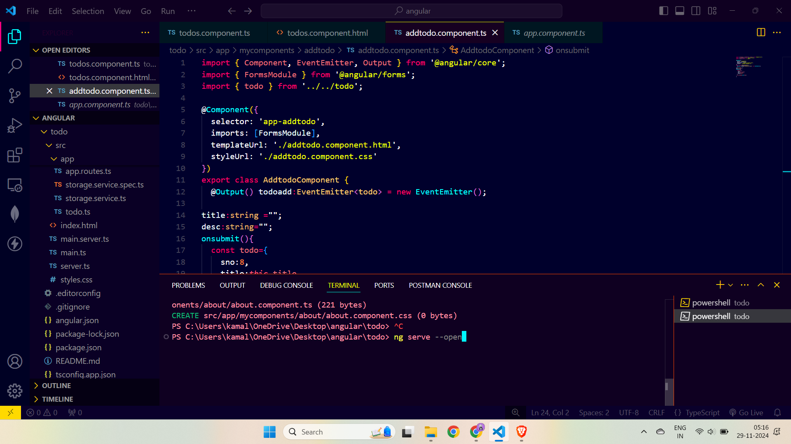

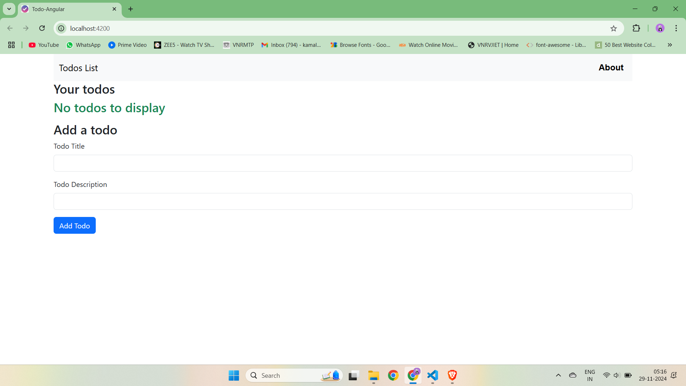

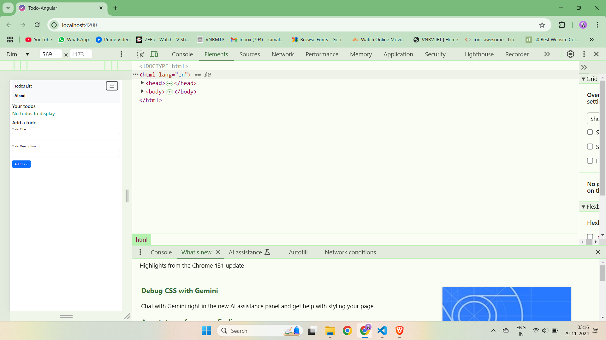

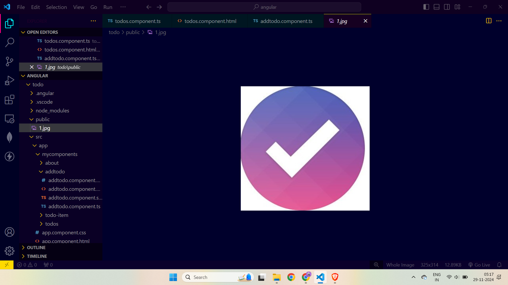


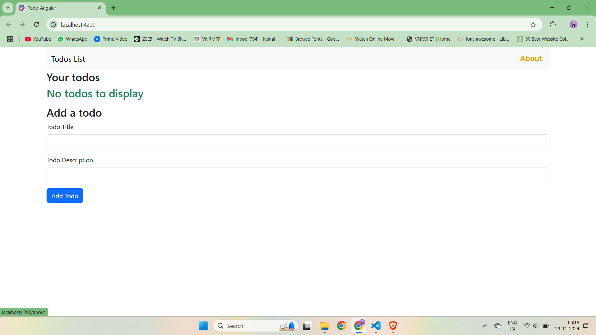


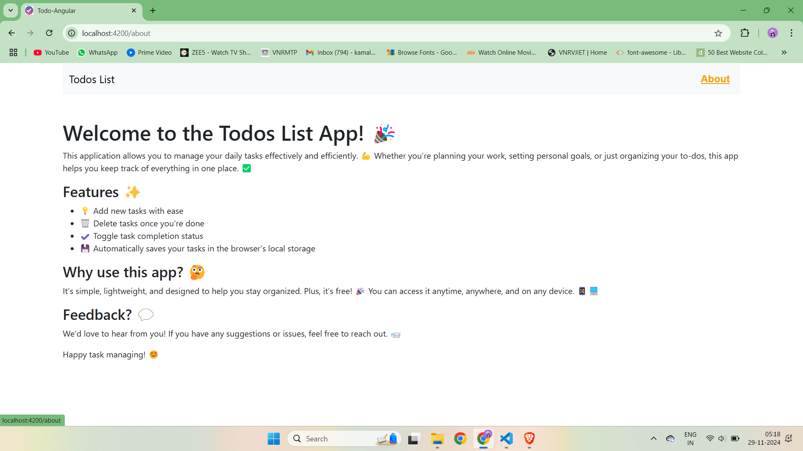


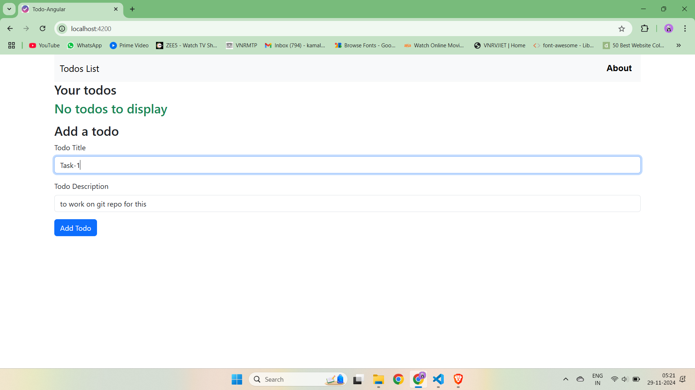


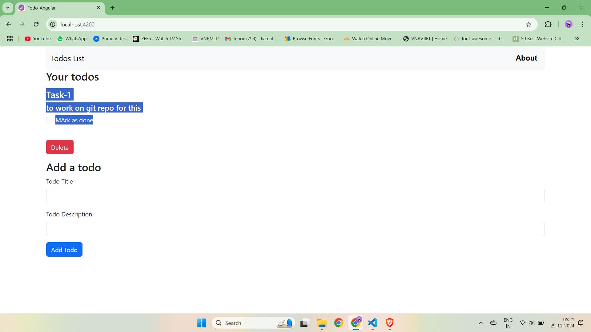


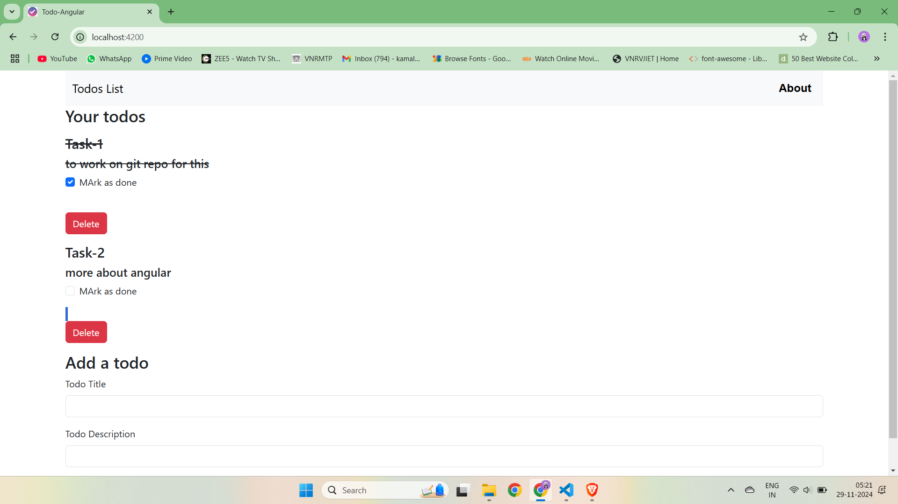


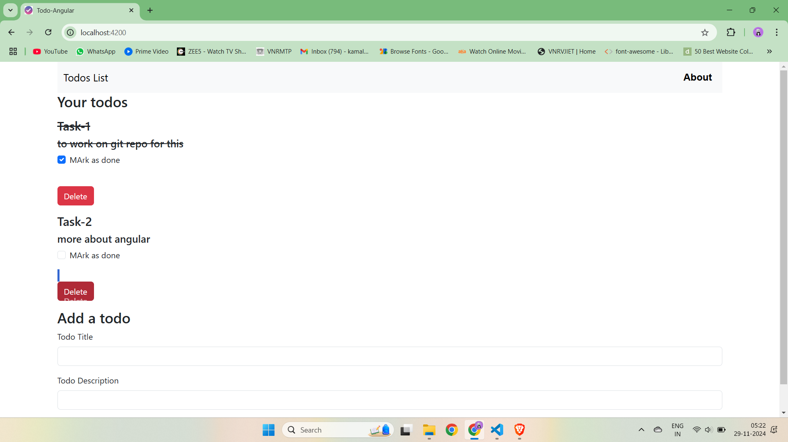


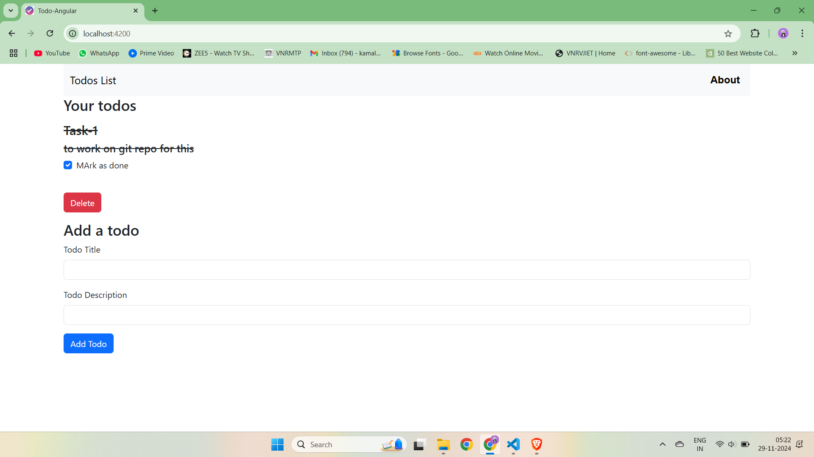


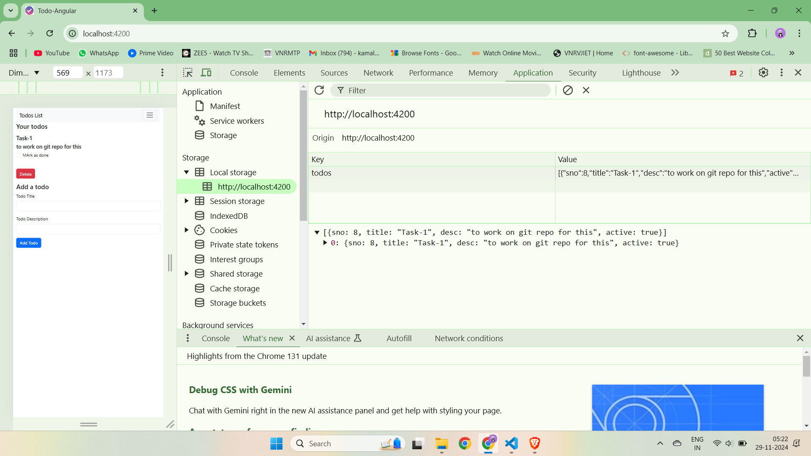


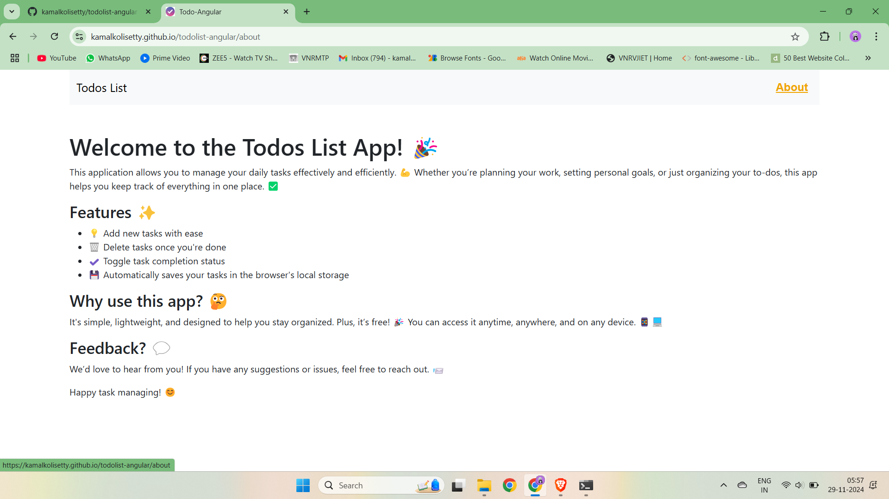


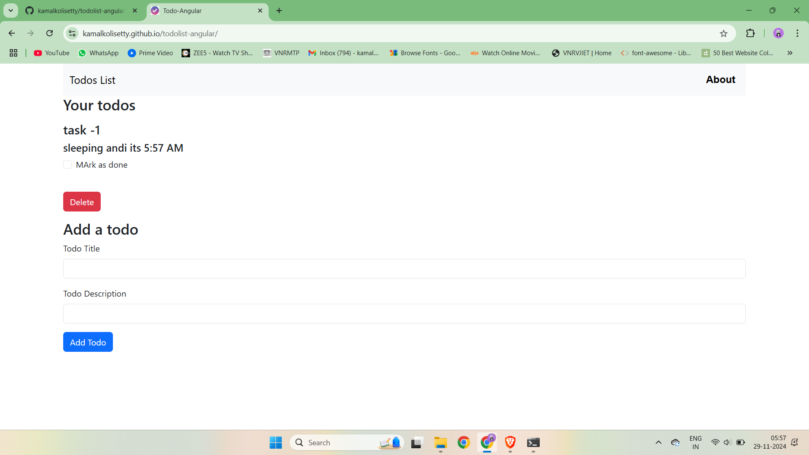


## **Conclusion** 🎉

This project has been an incredible learning experience for me. I’ve gained hands-on experience working with Angular, and I truly love the framework. The structured approach, powerful features like **two-way data binding**, and tools like **TypeScript** have made this journey enjoyable and educational. I can’t wait to continue building more applications with Angular! 🚀


 
